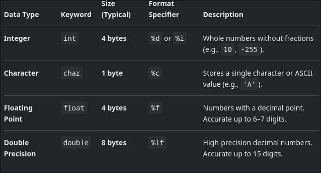
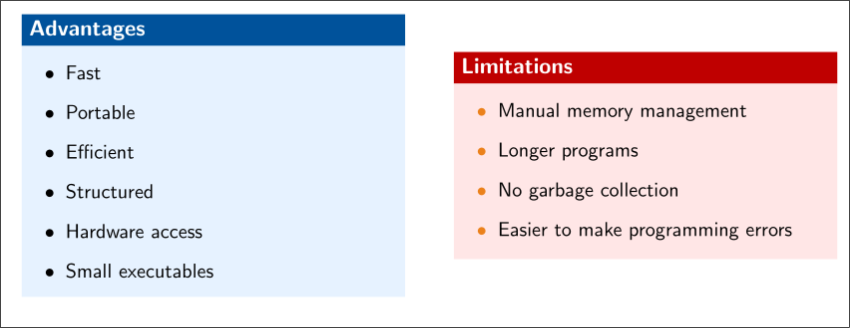

# Intro to C
C is a general-purpose procedural programming language developed by Dennis Ritchie at Bell Labs in 1972.

Characteristics

- High performance
- Portable
- Efficient
- Structured programming language
- Close to hardware

Applications

- Operating Systems
- Embedded Systems

WHY C?

- easy to understand comp arch 
- Very fast execution times
- Efficient memory storage
- Foundation for C++, Java and other languages
- Widely used in industry

### Operators
> Arithmetic `+ - * / %`

> Relational operations `== != > < >= <= `

>Conditional operators ` && and ,|| or, ! not`

